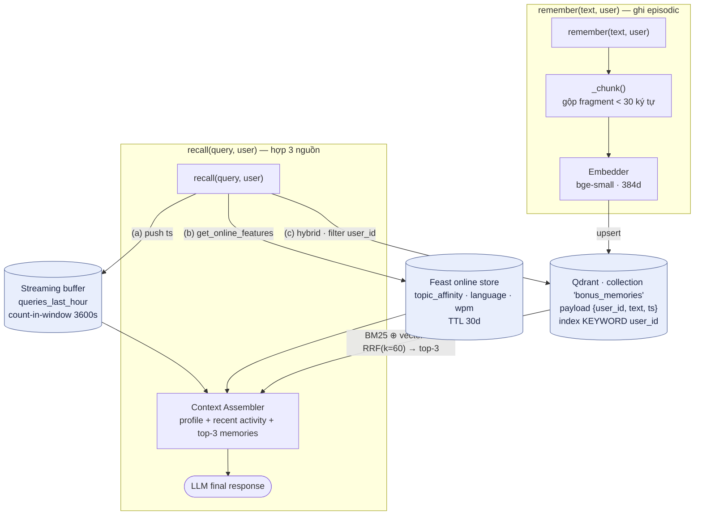

# Kiến trúc — Hybrid Memory cho Trợ lý AI cá nhân (tiếng Việt)

> **Contributors:** Nguyễn Vũ Hà An (solo).
> **Bonus challenge** của Lab 19 — Vector & Feature Store. POC chạy được:
> `python bonus/demo.py` (exit 0). Code: [`agent.py`](agent.py), [`demo.py`](demo.py).

## 1. Tổng quan

Trợ lý phải *nhớ* ba thứ có vòng đời rất khác nhau, nên tôi tách thành ba
store thay vì nhét chung:

| Nhớ cái gì | Vòng đời | Hạ tầng | Truy cập |
|---|---|---|---|
| **Episodic** — hội thoại, tài liệu đã đọc | mới mỗi giờ | Vector store (Qdrant) | ANN top-K |
| **Stable profile** — ngôn ngữ, tốc độ đọc, lĩnh vực quan tâm | đổi theo tuần | Feature store (Feast) | key lookup |
| **Recent activity** — query 1h qua | thay đổi từng giây | Streaming buffer | count-in-window |

`recall()` hợp ba nguồn thành một *context string* (không gọi LLM thật — đó
là input mà LLM *sẽ* nhận).

### Sơ đồ data flow

## 2. Ba quyết định kiến trúc

### 2.1 Chunking — *per-sentence gộp fragment*, không per-message / per-conversation

Tôi chunk episodic memory theo **câu** rồi gộp mẩu < 30 ký tự vào câu trước
([`_chunk()`](agent.py)).

- **Per-message** (mỗi tin nhắn 1 chunk): retrieval precision cao nhưng một
  ghi chú dài bị vỡ vụn → top-K bị lấp đầy bởi mảnh của *cùng một* ý, giảm
  recall thực. Storage lớn (nhiều vector nhỏ).
- **Per-conversation** (cả cuộc 1 chunk): rẻ về storage, nhưng một vector
  384-chiều phải đại diện cho nhiều chủ đề → điểm cosine loãng, và khi ghép
  vào prompt thì tốn context window cho phần không liên quan.
- **Per-sentence (chọn)**: cân bằng — mỗi chunk một ý, đủ ngữ cảnh để embedding
  có nghĩa, và top-3 ghép vào prompt vẫn gọn. Tradeoff **retrieval quality ↔
  storage cost ↔ context window** nghiêng về quality/context, chấp nhận nhiều
  vector hơn per-conversation.

### 2.2 Feature schema — *tabular* cho profile, không embedding-feature

`user_profile_features` (định nghĩa trong
[`app/feast_repo/feature_views.py`](../app/feast_repo/feature_views.py)) dùng
feature **dạng bảng**:

| Feature | Entity | Kiểu | TTL | Source |
|---|---|---|---|---|
| `topic_affinity` | user | String | 30d | user_profile_source (Parquet) |
| `preferred_language` | user | String | 30d | user_profile_source |
| `reading_speed_wpm` | user | Int64 | 30d | user_profile_source |
| `queries_last_hour` | user | Int64 | 1h | streaming |

- **Embedding-feature** (nén lịch sử user thành 1 vector "sở thích tiềm ẩn"):
  mạnh cho re-ranking, nhưng **không giải thích được** ("vì sao gợi ý cái này?")
  và mỗi lần đổi model embedding phải backfill toàn bộ.
- **Tabular (chọn)**: `topic_affinity="cloud"` là giá trị người và LLM đều đọc
  được → đưa thẳng vào context string (xem output query #2, u_001 →
  `topic_affinity=cloud`). Đánh đổi: kém tinh vi hơn embedding, nhưng
  *inspectable* và rẻ. POC ưu tiên clarity.

### 2.3 Freshness — *ba tầng cho ba use case*

Đây là quyết định trung tâm. "Bao lâu thì recall phản ánh thứ user vừa làm?"
phụ thuộc use case:

| Use case | Yêu cầu tươi | Cơ chế | TTL |
|---|---|---|---|
| "Tôi vừa hỏi gì?" (recent activity) | **sub-second** | streaming push vào buffer trong agent | 1h |
| "Trợ lý biết gì về tôi?" (profile) | phút → ngày | Feast batch `materialize` | 30d |
| Độ phổ biến tài liệu (item popularity) | ~phút/giờ | mixed batch+stream | 24h |

- **Sub-second push vs 5-min batch vs daily**: nếu recent-activity đi qua batch
  5 phút, câu "tôi đang quan tâm gì gần đây?" sẽ *trễ* — user hỏi tiếp ngay thì
  chưa thấy. Nên tôi để nó ở tầng **push** (buffer `_activity`, đếm cửa sổ 3600s):
  demo cho thấy counter tăng 1→5 realtime qua 5 query.
- Ngược lại, profile (ngôn ngữ, wpm) đổi theo tuần → daily batch là dư; push
  ở đây chỉ tốn hạ tầng streaming vô ích. Đánh đổi **độ tươi ↔ chi phí**: chọn
  tầng theo tốc độ đổi của dữ liệu, không "push tất cho chắc".

## 3. Một lựa chọn tôi đã loại bỏ

Tôi **xem xét lưu episodic memory như một embedding feature-view trong Feast**
(user → vector "ký ức gần nhất") **nhưng tách sang vector store riêng** vì: (1)
re-index cycle khác hẳn — memory sinh mới mỗi giờ còn profile ổn định theo tuần,
nhét chung buộc TTL/materialize phải thoả hiệp; (2) truy cập khác — episodic cần
**ANN top-K** trên hàng nghìn vector, Feast online store tối ưu cho **key lookup**
1 dòng/entity chứ không phải nearest-neighbour. Dùng sai công cụ sẽ vừa chậm vừa
sai ngữ nghĩa.

## 4. Cân nhắc cho ngữ cảnh tiếng Việt

- **Code-switching vi/en**: memory thực tế trộn "Kubernetes dùng *Horizontal Pod
  Autoscaler*…". Model mặc định `bge-small-en-v1.5` là **tiếng Anh** → paraphrase
  thuần Việt yếu (đúng bài học NB2). Hybrid cứu được: query #4 "tự động **mở rộng**
  hạ tầng" trúng "Terraform… **mở rộng** cụm" nhờ **BM25** bắt từ khoá còn sót,
  trong khi vector một mình sẽ trượt. Prod: đổi `EMBEDDING_BACKEND=multilingual`.
- **Tokenizer**: tôi cố ý whitespace-split ([`_tokenize`](agent.py), khớp
  `app/search.py`). Tiếng Việt "học máy" là 2 âm tiết = 1 từ → whitespace tách
  sai. Đánh đổi: **pyvi/underthesea** tách từ đúng (tăng recall BM25) nhưng thêm
  ~vài trăm MB và độ trễ; POC giữ nhẹ, ghi nợ kỹ thuật rõ ràng.
- **Privacy / Nghị định 13**: mỗi user chỉ được thấy memory của mình. Tôi enforce
  bằng **payload index `user_id` + filtered-ANN** (`query_filter`, pattern NB5),
  nên filter nằm *trong* vòng ANN chứ không lọc-sau (tránh recall cliff).

## 5. Liên kết với lab concepts

- **RRF** (NB2): `_rrf()` chép đúng `1/(k+rank)`, k=60 từ `app/search.py`.
- **Filtered-ANN** (NB5): cô lập theo `user_id` qua `query_filter`.
- **TTL** (NB4): 1h cho activity vs 30d cho profile — chính là §2.3.
- **PIT join** (NB4/NB8): tuy POC dùng online store, việc *train* re-ranker cá
  nhân hoá sau này bắt buộc `get_historical_features` (as-of join) để không rò
  nhãn tương lai — nếu latest-join, accuracy train đẹp mà prod tệ 20–30%.

## 6. What this POC doesn't handle yet

- **Encryption at rest** cho memory (Nghị định 13 khuyến nghị mã hoá PII).
- **CRUD / memory decay** — chưa xoá/sửa/lãng quên; nên có TTL + pruning "30 ngày không truy cập → archive".
- **Personalization re-ranking** — hiện `topic_affinity` chỉ *hiển thị* trong context cho LLM, chưa *boost* thứ hạng episodic theo affinity (query #2 chưa ưu tiên "cloud"). Bước tiếp: RRF 3-retriever (BM25 + vector + affinity).
- **Per-user collection thật** — đang một collection lọc theo payload; multi-tenant lớn có thể cần tách collection.
- **Multi-device sync** và **LLM planner thật** (thay `RuleBasedPlanner` như gợi ý trong `app/agent.py`).

---

### Phụ lục — Vibe-coding log (~100 từ)

**Prompt hiệu quả nhất:** "Tái sử dụng `Embedder`, công thức RRF trong
`search.py`, và pattern filtered-ANN trong `filters.py` — đừng viết lại." Ép
AI bám hạ tầng lab giúp code nhất quán, không phát sinh dependency.
**Prompt fail:** để AI tự chọn nguồn cho *recent activity* — nó mặc định đọc
`query_velocity_features` của Feast, nhưng TTL 1h đã hết hạn nên luôn trả None.
*Quyết định kiến trúc* (dùng streaming buffer thay vì batch view stale) là phần
tôi phải tự nghĩ — AI không suy ra được từ code. Đúng tinh thần bonus: boilerplate
giao AI, judgment giữ lại.
